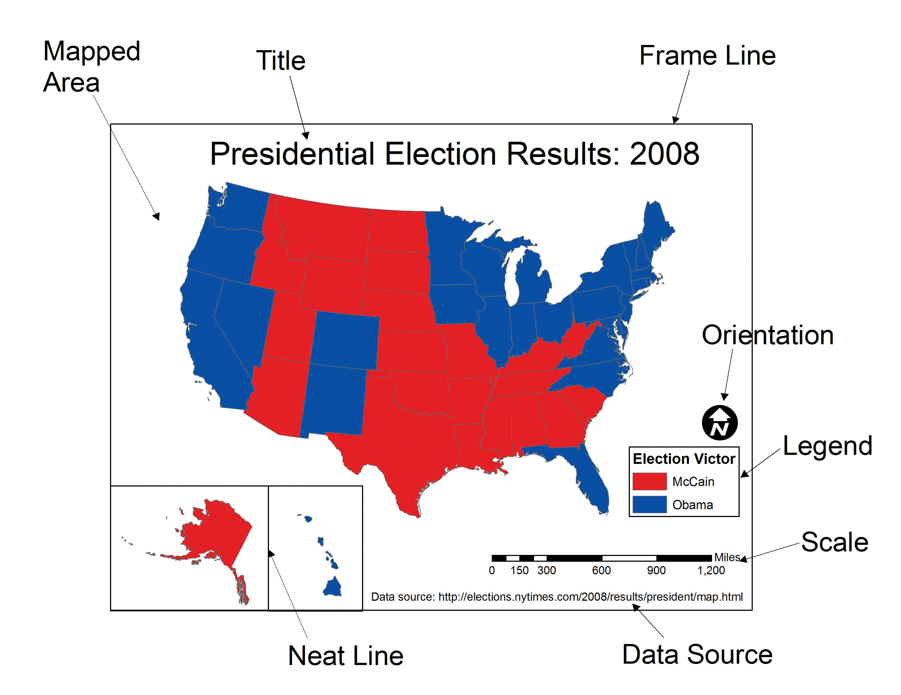
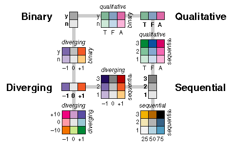
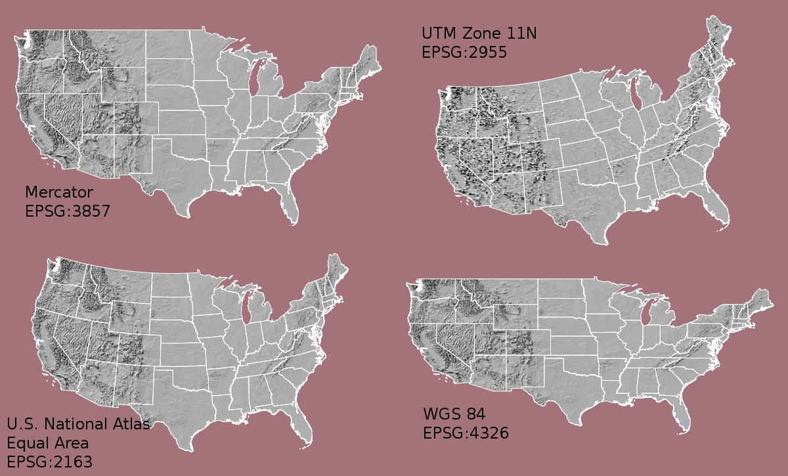
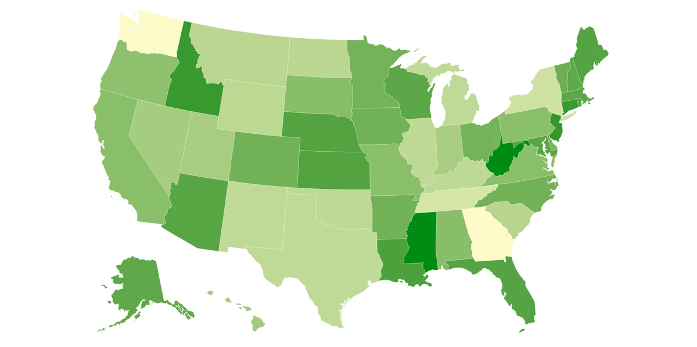
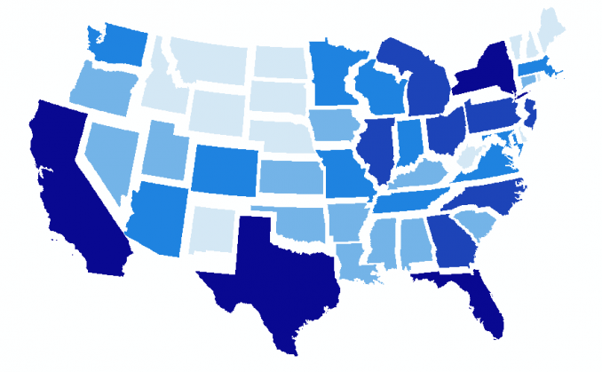
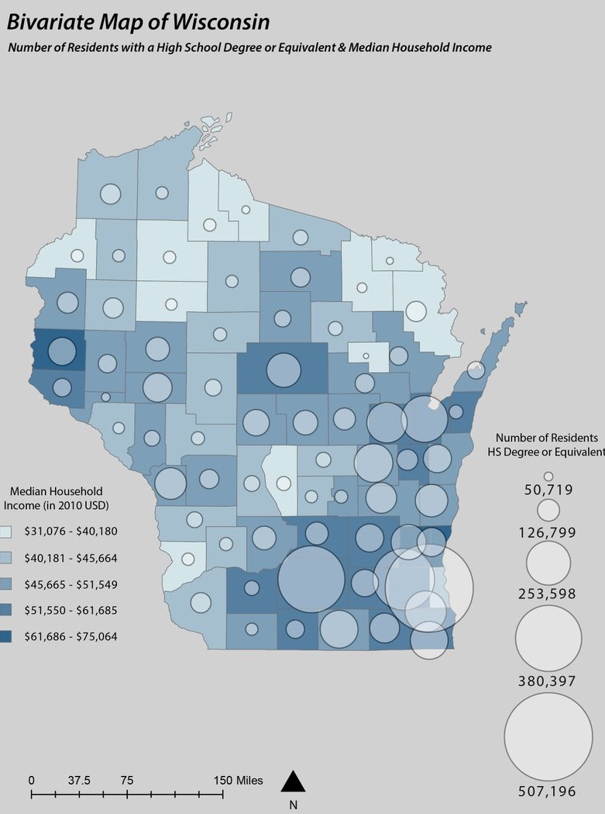

:::::::::::::::::::::::::::::::::::::: questions

- What makes a visualization effective versus misleading?
- What are the essential elements of a well-designed map?
- How do color, scale, projection, and classification choices shape what a map communicates?
- What are the main thematic map types and when should each be used?

::::::::::::::::::::::::::::::::::::::::::::::::

::::::::::::::::::::::::::::::::::::: objectives

- Understand the purpose and principles of data visualization
- Identify the core components of an effective map
- Select appropriate colors, symbols, projections, and classification methods for your data
- Recognize common thematic map types and when to use them
- Apply a checklist-based approach to cartographic design

::::::::::::::::::::::::::::::::::::::::::::::::

## What Is Data Visualization?

**Data visualization** is the graphical representation of information. Instead of rows and columns of numbers, it uses charts, graphs, maps, and dashboards to make patterns, trends, and outliers immediately understandable.

Our brains devote more than half their processing power to vision. A well-chosen chart is not just convenient — it is cognitively more efficient than a table. Visualization helps because it:

- **Reveals what numbers hide** — trends, clusters, correlations, and geographic patterns are rarely obvious in raw data but become clear in a well-designed graphic.
- **Speeds up decision-making** — researchers, policymakers, and the public routinely use visuals to interpret evidence quickly.
- **Surfaces data quality problems** — missing values, impossible ranges, and duplicates often become obvious once the data is plotted.
- **Communicates across audiences** — a clear map or chart can be understood by both domain experts and non-technical stakeholders.

There are two broad modes of visualization:

- **Exploratory visualizations** help *you* discover insights — quick, rough, disposable.
- **Explanatory visualizations** help *others* understand your findings — polished, annotated, purposeful.

Knowing which mode you are in shapes every design decision that follows.

---

## Advantages and Risks

### Advantages

- Spot trends in seconds rather than hours of reading tables.
- One well-designed image can replace thousands of numbers.
- Interactive visuals capture attention and improve retention.
- Visualization turns statistics into compelling, memorable narratives.

### Risks

- **Misleading design** — a truncated axis, 3D effects, or cherry-picked color scales can distort the truth.
- **Chartjunk** — decorative elements (unnecessary gridlines, shadows, clip art) that add noise without adding information.
- **Over-simplification** — reducing a complex relationship to a single chart can flatten important nuance.
- **Accessibility barriers** — poor color contrast or reliance on color alone to encode information excludes users with color vision deficiencies.

::::::::::::::::::::::::::::::::::::: callout

### The "Lying With Charts" Phenomenon

Visual choices that seem minor — axis scale, color palette, which data points to include — can completely change what a chart appears to say. Always ask: *"Does this visual tell the whole story, or just the story I want to tell?"*

::::::::::::::::::::::::::::::::::::::::::::::::

---

## What Makes a Good Map?

A map is not just a picture — it is a **communication tool**. Every element you include or omit sends a message.

A good map:

- Has a clear, single purpose
- Accurately represents data
- Is easy to interpret
- Minimizes misleading elements
- Includes essential map elements: **title, legend, scale bar, north arrow, and data source**

Before making any design decisions, answer these three questions:

1. **Who is my audience?** — Experts need detail and precision; a general audience needs simplicity and clear labels.
2. **What is my message?** — State it in one sentence. Maps that try to show everything communicate nothing.
3. **Where will it be displayed?** — Web maps can be interactive; print maps are static and must work at a fixed size; presentation slides need bold, simple visuals.

---

## Visual Hierarchy

Visual hierarchy controls what the viewer notices first, second, and last. A well-structured hierarchy guides the eye toward the most important information without effort.

| Visual tool | Effect | Practical use |
|---|---|---|
| **Size** | Larger elements draw attention first | Make your primary data layer the most prominent |
| **Color** | Brighter or contrasting colors stand out | Reserve saturated colors for key data; mute the basemap |
| **Position** | Central elements are noticed before edges | Place the main map center-frame |
| **Contrast** | Strong differences signal importance | High contrast between data and background |

In practice: bold, saturated colors for your data layer; muted tones for the basemap; labels that are legible but visually subordinate.

---

## Visual Variables

Visual variables are the properties used to encode data on a map. Choosing the right one for your data type is one of the most important decisions in map design.

| Visual variable | Best data type | Example |
|---|---|---|
| **Color hue** (distinct colors) | Categorical / nominal | Land use types, political parties |
| **Color value** (light → dark) | Quantitative / ordered | Population density, income levels |
| **Size** | Quantitative at point locations | City population, earthquake magnitude |
| **Shape** | Categorical at point locations | Hospital vs. school vs. fire station |
| **Orientation** | Directional data | Wind direction, flow arrows |
| **Texture / pattern** | Categorical areas (especially print) | Zoning districts, vegetation types |

**Rule of thumb:** Quantitative data (numbers with order) → color value or size. Categorical data (named groups, no order) → color hue, shape, or texture.

---

## Colors on Maps

Color is the most powerful visual variable — and the most commonly misused. The right color scheme depends on the type of data.

- **Sequential** — low to high values; light to dark (e.g., pale yellow → dark red for population density).
- **Diverging** — values that vary around a midpoint; two directions from a neutral center (e.g., blue–white–red for temperature anomaly).
- **Categorical** — distinct groups with no order; visually distinct hues (e.g., land cover classes).

**Best practices:**

- Lighter shades for lower values, darker for higher — this matches most readers' intuition.
- Always use colorblind-friendly palettes. About 8% of men have some form of color vision deficiency, and red-green combinations are the most common problem.
- Ensure sufficient contrast between adjacent classes so boundaries are visible.
- When in doubt, use [ColorBrewer](https://colorbrewer2.org) — it provides palettes that are colorblind-safe, print-friendly, and photocopy-safe.

---

## Scale

Map scale defines the relationship between distance on the map and distance on the ground.

- **Large-scale maps** cover a small area with high detail (e.g., a neighborhood at 1:5,000).
- **Small-scale maps** cover a large area with less detail (e.g., a world map at 1:50,000,000).

Scale determines what level of detail is visible and appropriate. Features that look correct at one scale can be misleading at another — a neighborhood-level pattern should not be inferred from a country-level map. Always include a **scale bar** so readers can estimate real-world distances.

---

## Projections

A map projection transforms the curved surface of the Earth onto a flat plane. Because you cannot flatten a sphere without distortion, every projection sacrifices at least one property: **area**, **shape**, **distance**, or **direction**.

| Projection family | What it preserves | Common use |
|---|---|---|
| Equal-area (Albers, Mollweide) | Area | Thematic maps where region size comparison matters |
| Conformal (Mercator, Lambert) | Local shape and angles | Navigation, topographic maps |
| Equidistant (Azimuthal equidistant) | Distance from a central point | Radial distance maps |
| Compromise (Robinson, Winkel Tripel) | None perfectly, but minimizes all | General-purpose world maps |

To see how dramatically Mercator distorts apparent country size, try [The True Size Of...](https://thetruesize.com). Drag Russia down to where Africa sits — the difference is striking.

::::::::::::::::::::::::::::::::::::: callout

### Tip

There is no "correct" projection — only projections suited to specific purposes. For U.S. Census and demographic work, the **Albers Equal Area Conic** is standard because it preserves area relationships between states and counties.

::::::::::::::::::::::::::::::::::::::::::::::::

---

## Labeling and Legends

Labels and legends transform a spatial image into a readable map.

**Labels:** Use readable font sizes, avoid overlapping features, apply halos (white outlines) for legibility over varied backgrounds, and size labels hierarchically — major features larger, minor features smaller.

**Legends:** Every encoded variable must be explained. Use plain language (not variable codes like `B19013_001E`), include units, and order entries logically — low to high for sequential data, alphabetically for categories.

**When to omit elements:** Skip a north arrow if north is obviously up. Skip a scale bar on schematic maps where exact distance is not the point. When in doubt, include it — a reader who does not need it will ignore it; a reader who does need it will be stuck.

---

## Thematic Map Types

Choosing the wrong map type for your data is one of the most common cartographic errors. Here are the most common types.

### Choropleth Maps

Uses color value (light to dark) across geographic regions.

**Best for:** Rates, ratios, and normalized data — population per square km, median income, percentage with a college degree. **Avoid for:** Raw counts. Larger regions will almost always have higher counts, making the map reflect area rather than the phenomenon. Always normalize before using a choropleth.

### Proportional Symbol Maps

Scales a symbol (typically a circle) at each location in proportion to a data value.

**Best for:** Comparing absolute magnitudes across discrete locations — total city population, number of cases per hospital. **Avoid for:** Continuous phenomena that cover entire regions.

### Dot Density Maps

Places dots within each geographic unit, where each dot represents a set quantity.

**Best for:** Showing spatial distribution and relative density — e.g., one dot = 1,000 people. **Avoid for:** Precise counts or when unit boundaries would create artificial clustering.

### Non-Contiguous Cartograms

Resizes each region in proportion to a data value and separates them so outlines remain recognizable.

**Best for:** Emphasizing magnitude (GDP, electoral votes) when geographic area would otherwise dominate. **Note:** Readers unfamiliar with cartograms may find them disorienting — include a brief explanation.

### Multivariate Maps

Encodes two or more variables simultaneously using different visual channels.

**Best for:** Exploring the relationship between two variables — e.g., income (color) alongside education (symbol size). **Use with caution:** Limit to two variables when possible. A third should only be added if the three-way relationship is genuinely the story.

---

## Data Classification Methods

When creating a choropleth, continuous data must be grouped into classes (typically 4–7) so distinct colors can be assigned. The method you choose has a large effect on the visual pattern — and therefore on the story the map appears to tell.

| Method | How it works | Best for | Watch out for |
|---|---|---|---|
| **Equal Interval** | Divides the full range into bins of equal width | Evenly distributed data | Misleading with skewed data — most observations may fall in one or two classes |
| **Quantile** | Places an equal number of observations in each class | Ranking and relative comparison | Similar values can end up in different classes |
| **Natural Breaks (Jenks)** | Finds boundaries at natural gaps in the distribution | Clustered or uneven data | Boundaries shift if the data changes |
| **Standard Deviation** | Classes defined by distance from the mean | Highlighting anomalies and extremes | Requires the audience to understand standard deviations |

**When in doubt, start with Natural Breaks.** It tends to produce the most honest representation of the underlying data structure.

::::::::::::::::::::::::::::::::::::: challenge

### Choosing a Classification Method

You have U.S. county median household income data ranging from $25,000 to $150,000. Most counties cluster between $45,000 and $75,000, with a small number of very high-income outliers.

1. Which classification method would you choose and why?
2. Which method would produce the most misleading map, and what would it get wrong?

::::::::::::::::::::::::::::::::::::::::::::::::

---

## Static vs. Interactive Maps

Decide your display format before making other design choices.

| Feature | Static map | Interactive map |
|---|---|---|
| Zoom and pan | No | Yes |
| Layer toggling | No | Yes |
| Hover for details | No | Yes |
| Print quality | High | Varies |
| Design control | Full | Partial |
| Development effort | Low | Higher |
| Best for | Single clear message | User-driven exploration |

Use **static maps** when you want to communicate one message as clearly as possible. Use **interactive maps** when readers need to explore, filter, or look up specific values. In this workshop we focus primarily on static maps produced in QGIS.

---

## Ethical Considerations

Visualizations can influence policy, investment, and public opinion. That creates responsibility.

- **Avoid cherry-picking** — selecting only the time window or subset that supports your conclusion is dishonest, even if every data point shown is accurate.
- **Disclose sources and limitations** — always cite the data source, note the date range, sample size, and known gaps.
- **Respect privacy** — geospatial and demographic data can expose individuals even when names are removed. Consider aggregation levels carefully.
- **Consider unintended consequences** — a crime-rate map, for example, can reinforce stereotypes if presented without context about policing patterns or historical disinvestment.

---

## Cartography Checklist

Before finalizing any map, work through this list:

- [ ] I have identified my target audience and tailored the design to their needs
- [ ] My map has a single, clearly stated purpose
- [ ] I have selected only the data variables that support that purpose
- [ ] My design choices (color, scale, symbology) do not introduce misleading interpretations
- [ ] The map is designed for its intended medium (web, print, or presentation)
- [ ] If the map informs decisions, I have communicated uncertainty and cited sources
- [ ] My dataset is complete, current, and at an appropriate spatial resolution
- [ ] I understand what the data measures and its known limitations
- [ ] The map includes a legend, data source citation, and scale bar where applicable
- [ ] I have tested my color palette for colorblind accessibility

---

::::::::::::::::::::::::::::::::::::: keypoints

- Data visualization turns numbers into stories the human brain can process quickly — but poor design can mislead more powerfully than raw data.
- Every map is a communication tool; define your audience, message, and medium before making design decisions.
- Match your thematic map type to your data: choropleth for normalized rates, proportional symbols for magnitudes, dot density for distributions.
- Color scheme, projection, and classification method choices directly affect what a map appears to say — choose intentionally.
- Run through the cartography checklist before publishing any map.

::::::::::::::::::::::::::::::::::::::::::::::::
