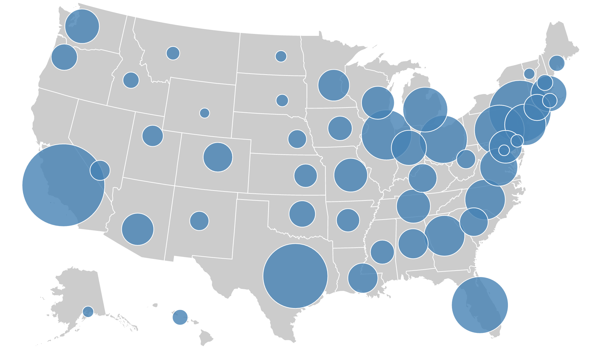
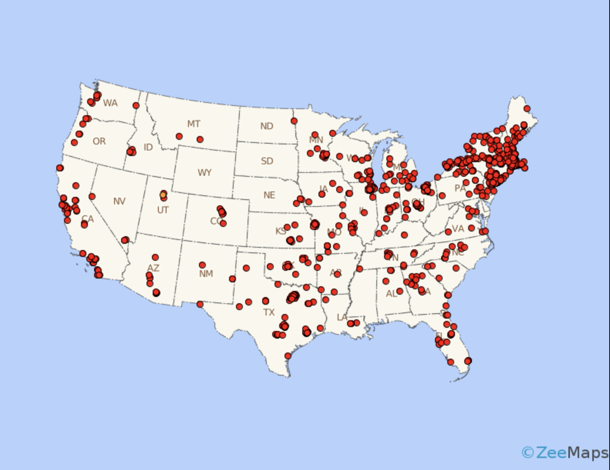
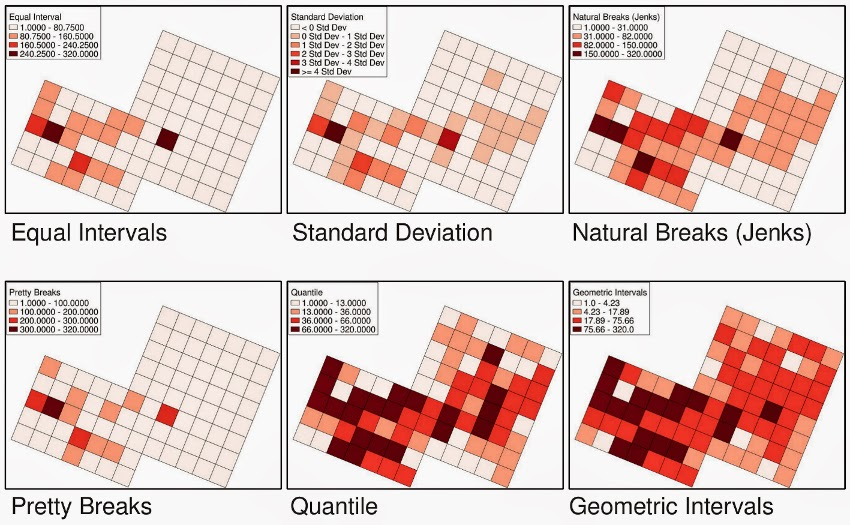

:::::::::::::::::::::::::::::::::::::: questions

- What is a map and what makes it effective?
- How do visual hierarchy and design influence interpretation?
- How should colors and symbols be used in maps?
- What are map scales and projections, and why do they matter?
- What are common thematic map types and when should you use them?
- Should your map be static or interactive?
- How should data be classified for choropleth maps?

::::::::::::::::::::::::::::::::::::::::::::::::

::::::::::::::::::::::::::::::::::::: objectives

- Understand the core components of a map
- Apply visual hierarchy principles to improve clarity
- Choose appropriate colors, scales, and projections
- Identify and use different thematic map types
- Decide between static and interactive maps
- Select appropriate classification methods for data

::::::::::::::::::::::::::::::::::::::::::::::::

## What is a Map?

A **map** is a visual representation of spatial data designed to communicate information about locations, patterns, and relationships.

A good map:-

- Has a clear purpose
- Accurately represents data
- Is easy to interpret
- Minimizes misleading elements
- **Has all the key map elements**

::::::::::::::::::::::::::::::::::::: callout

### Key Idea
A map is not just a picture — it is a **communication tool**.

::::::::::::::::::::::::::::::::::::::::::::::::

---

## Visual Hierarchy

Visual hierarchy controls what the viewer sees first, second, and last.

### How to create hierarchy:
- **Size** → larger elements draw attention
- **Color** → brighter or contrasting colors stand out
- **Position** → central elements are noticed first
- **Contrast** → strong differences highlight importance

### Example:
- Main data layer → bold colors
- Background (basemap) → muted tones
- Labels → readable but not overpowering

::::::::::::::::::::::::::::::::::::: challenge

Look at a map and ask:
What do you notice first? Is that what the mapmaker intended?

::::::::::::::::::::::::::::::::::::::::::::::::

---

## Variables in Mapping

Cartographic variables (visual variables) represent data visually.

### Common variables:
- Color (hue, lightness)
- Size
- Shape
- Orientation
- Texture

### Use cases:
- **Quantitative data** → size, lightness
- **Categorical data** → distinct colors, shapes

---

## Colors on Maps

Color choice is critical for readability and accuracy.

### Types of color schemes:
- **Sequential** → low to high values (e.g., light → dark)
- **Diverging** → values around a midpoint (e.g., blue–white–red)
- **Categorical** → distinct groups

### Best practices:
- Avoid overly bright or clashing colors
- Use colorblind-friendly palettes
- Ensure contrast between classes

::::::::::::::::::::::::::::::::::::: callout

### Tip
Use lighter colors for lower values and darker colors for higher values in most cases.

::::::::::::::::::::::::::::::::::::::::::::::::

---

## Scale

Map scale defines the relationship between distance on the map and distance in reality.

### Types:
- **Large-scale maps** → small area, high detail (e.g., city map)
- **Small-scale maps** → large area, less detail (e.g., world map)

### Why it matters:
- Determines level of detail
- Affects interpretation of patterns

---

## Projections

A projection transforms the Earth (a sphere) onto a flat surface.

### Key issue:
All projections introduce distortion in:
- Area
- Shape
- Distance
- Direction

### Examples:
- Equal-area → preserves area
- Conformal → preserves shape
- Equidistant → preserves distance

Check [here](https://thetruesize.com/#?borders=1~!MTQ0MTQxNzQ.MzE5MDM0NQ*MzMyMDA2Mzk(NjIwMDYzOQ~!CONTIGUOUS_US*MTAwMjQwNzU.MjUwMjM1MTc(MTc1)MQ~!IN*NDMzNzg1.MTIxNjQ4Nzk)Mg~!CN*OTkyMTY5Nw.NzMxNDcwNQ(MjI1)Mw) to play around how `Mercator` Projection effects size of countries. You can move each countries across latitudes to compare its true size with another country. 

**Tip:** Try selecting `Russia` and drag it all the way down to where `Africa` is. You will be amazed by the result!

::::::::::::::::::::::::::::::::::::: callout

### Important
There is no “perfect” projection — only projections suited for specific purposes.

::::::::::::::::::::::::::::::::::::::::::::::::

---

## Labeling and Legends

Labels and legends help users understand your map.

### Labels:
- Clear and readable
- Avoid overlap
- Use hierarchy (important places larger)

### Legends:
- Explain symbols and colors
- Keep simple and intuitive
- Include units where necessary

---

## Thematic Map Types

### Choropleth Maps

Used to show values aggregated by regions (e.g., counties, states).

**Best for:**
- Rates, ratios, normalized data (e.g., per capita)

**Avoid:**
- Raw counts (can mislead due to area size)

---

### Proportional Symbol Maps

Symbols sized according to data values.

**Best for:**
- Comparing magnitudes across locations

---

### Dot Density Maps

Dots represent occurrences or quantities.

**Best for:**
- Showing distribution patterns

---

### Non-Contiguous Cartograms

Regions resized based on data values.

**Best for:**
- Emphasizing magnitude over geography

---

### Multivariate Maps

Show multiple variables at once.

**Best for:**
- Exploring relationships between variables

---

## Static vs Interactive Maps

### Static Maps:
- Fixed image
- Best for print and reports
- Easier to control design

The map images that we have shown above are all examples of static maps. 

### Interactive (Web) Maps:
- Allow zooming, filtering, tooltips
- Ideal for exploration
- Require more development effort

See [here](https://spatialturn.github.io/). Scroll down and you should see an interactive map of West Lafayette that we implemented in our website!

### What is a Web Map?

A **web map** is an interactive map delivered through a browser.

Examples include:
- Zoomable maps
- Layer toggles
- Hover/click information

::::::::::::::::::::::::::::::::::::: callout

### Guideline
Use interactive maps when users need to explore data.  
Use static maps when you want to communicate a single message clearly.

::::::::::::::::::::::::::::::::::::::::::::::::

---

## Data Classification Methods

Classification determines how numeric data is grouped into categories.

### Equal Interval

- Divides range into equal-sized bins
- Best for evenly distributed data

---

### Quantile

- Each class has the same number of observations
- Best for comparing relative rankings

---

### Natural Breaks (Jenks)

- Minimizes variance within classes
- Best for clustered data

---

### Standard Deviation

- Shows deviation from the mean
- Best for highlighting extremes

---

## Choosing the Right Classification

| Method             | Best Use Case                          |
|------------------|----------------------------------------|
| Equal Interval    | Uniform distributions                  |
| Quantile          | Ranking/comparison                     |
| Natural Breaks    | Uneven, clustered data                 |
| Standard Deviation| Highlighting anomalies/outliers        |

**Beginner Recommendation:** Start with Natural Breaks (Jenks) — it usually gives the most honest visual pattern.

::::::::::::::::::::::::::::::::::::: challenge

You are mapping income data with strong clustering.  
Which classification method would you choose and why?

::::::::::::::::::::::::::::::::::::::::::::::::

::::::::::::::::::::::::::::::::::::: challenge

You have U.S. county median household income data ranging from $25k to $150k with a strong cluster around $55k–$70k.

Which `classification` method would you choose and why?
::::::::::::::::::::::::::::::::::::::::::::::::

---

## Final Takeaways

- Maps are communication tools — design intentionally
- Choose map types based on your data and message
- Use classification methods carefully to avoid misleading results
- Always consider your audience and purpose

::::::::::::::::::::::::::::::::::::: discussion

- When might an interactive map be worse than a static map?
- How can classification choices change the story your map tells?

::::::::::::::::::::::::::::::::::::::::::::::::