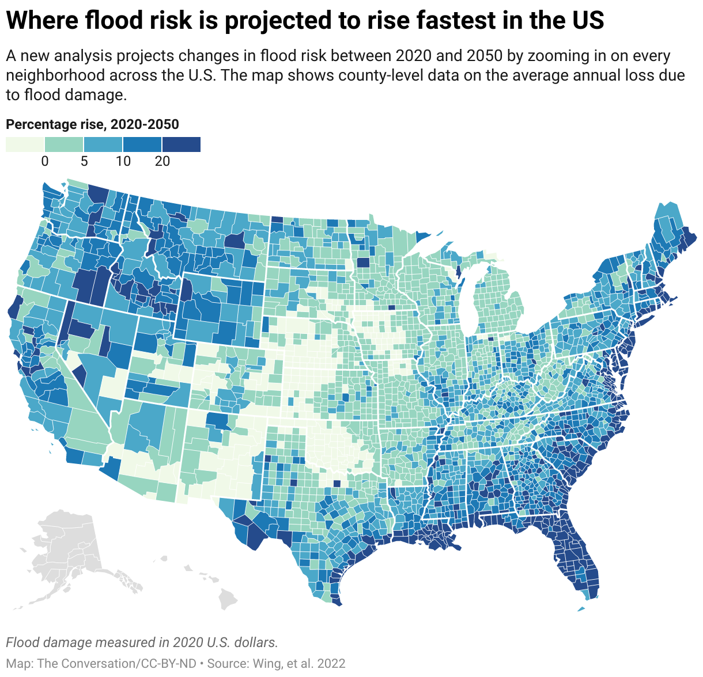
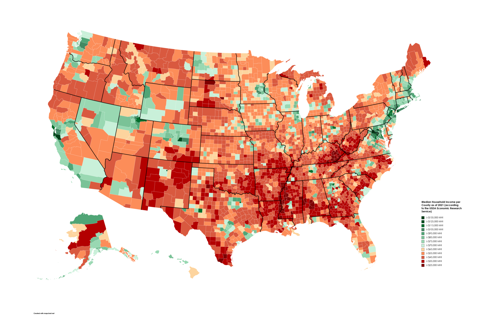
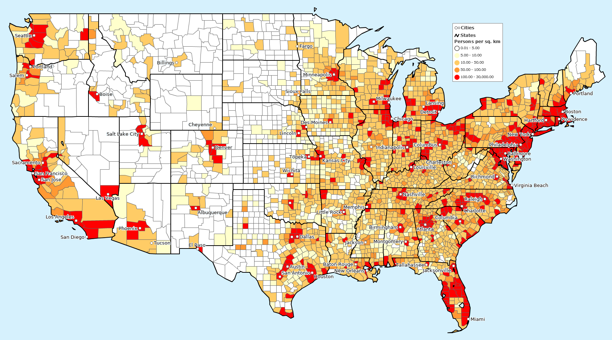

:::::::::::::::::::::::::::::::::::::: questions

- Who is the primary audience for your map?
- What message or story are you trying to communicate?
- Which data attributes are most important to show?
- How will your audience interpret or react to your map?
- What medium will your map be presented in (web, print, presentation)?
- Will your map be used to inform decisions?
- What does your audience already know, and what do they need explained?
- Do you need more data to support your map?
- Do you fully understand the topic you are mapping?

::::::::::::::::::::::::::::::::::::::::::::::::

::::::::::::::::::::::::::::::::::::: objectives

- Identify the purpose and audience of a map before starting design
- Choose appropriate data and variables to support your message
- Design maps that communicate clearly, honestly, and accessibly
- Evaluate whether additional data or context is needed
- Apply a checklist-based approach to cartographic design decisions

::::::::::::::::::::::::::::::::::::::::::::::::

::::::::::::::::::::::::::::::::::::: keypoints

- Always define your audience and message before making any design decisions.
- Not all data belongs on a map — choose variables that are spatially meaningful and support your story.
- Design choices (color, scale, symbology) are never neutral; they shape how readers interpret your map.
- Match your map's complexity and medium to what your audience needs and expects.
- If your map informs decisions, accuracy, transparency, and uncertainty communication are critical.
- Run through the cartography checklist before finalizing any map.

::::::::::::::::::::::::::::::::::::::::::::::::

## Why Thoughtful Map Design Matters

Maps are powerful tools for communication. A well-designed map can reveal spatial patterns, support decisions, and tell compelling stories. A poorly designed map can mislead, confuse, or hide important insights.

Before making a map, it is essential to ask the right questions. Good cartography is guided by a set of core design principles:

- **Legibility** — the map is easy to read at its intended size and medium
- **Visual contrast** — important elements stand out from the background
- **Figure-ground** — the main features pop from the background clearly
- **Hierarchy** — the most important information is visually prominent
- **Balance** — the layout feels organized without clutter

These principles interact with every decision you make, from color palette to label placement. The nine sections below translate them into concrete questions you should answer before finalizing any map.

---

## 1. Know Your Audience

Your audience determines everything — the level of detail, the choice of terminology, the complexity of symbology, and even whether a legend needs to define basic terms.

### Ask yourself

- Are they experts, policymakers, or the general public?
- How familiar are they with maps and with your specific topic?
- What level of detail is appropriate, and what would overwhelm them?

### Examples

- **General audience** → simple labels, clear legend, minimal jargon, large text
- **Scientific audience** → more detail, precise scale bars, technical terminology, data source citations

::::::::::::::::::::::::::::::::::::: callout

### Key Idea

A map designed for scientists and a map designed for the general public should not look the same — even if they show identical data. Tailor every design choice to the reader, not to the data.

::::::::::::::::::::::::::::::::::::::::::::::::

---

## 2. Define Your Message

Every map should answer a single, clearly stated question. Maps that try to show everything end up communicating nothing.

### Ask yourself

- What is the one most important takeaway a reader should leave with?
- Are you showing spatial patterns, comparisons between places, or change over time?
- Can you state the map's purpose in a single sentence?

### Avoid

- Encoding too many variables at once (e.g., color + size + shape + animation simultaneously)
- Leaving the reader to "figure it out" without a guiding title or annotation

### Good example

> "This map shows U.S. counties projected to face the highest flood risk by 2050."

That sentence is a complete map brief: it names the variable (flood risk), the geography (U.S. counties), the time horizon (2050), and the framing (highest risk).

---

## 3. Choose the Right Data Attributes

Not all data belongs on your map. Only include variables that are spatially meaningful and directly support your stated message.

### Ask yourself

- Which single variable is most important to show?
- Are there supporting variables (e.g., population, elevation) that add necessary context without cluttering the map?
- Is the data type appropriate for the geometry — points for discrete locations, lines for networks, polygons for areas?

### Visual encoding guidelines

| Visual variable | Best used for | Example |
|---|---|---|
| **Color hue** | Categories (nominal data) | Land use types |
| **Color value** (light → dark) | Magnitude (ordinal or continuous data) | Rainfall amount |
| **Size** | Quantities at point locations | City population |
| **Shape** | Distinguishing symbol types | Hospitals vs. schools |
| **Pattern / texture** | Categories on print maps | Zoning districts |

::::::::::::::::::::::::::::::::::::: challenge

### Quick Check

You have three variables available: temperature, precipitation, and elevation.

Your goal is to create a map that highlights areas at greatest drought risk.

- Which variable would you prioritize as your primary encoded attribute?
- Which (if any) would you include as supporting context?
- Which would you leave off entirely, and why?

::::::::::::::::::::::::::::::::::::::::::::::::

---

## 4. Consider Audience Perception

Maps are never neutral. Every design choice — color, scale, projection, classification method — shapes how readers interpret what they see. Being aware of this is not optional; it is part of responsible cartography.

### Ask yourself

- Could your color choices carry unintended connotations (e.g., red implying danger, green implying safety)?
- Are you inadvertently introducing bias through classification breaks or data selection?
- Can the map's main message be grasped within a few seconds?

### Common perception pitfalls

- **Color value confusion**: Using very light colors for high values (or vice versa) contradicts most readers' intuition that darker = more.
- **Unequal class intervals**: A choropleth using natural breaks will look very different from one using equal intervals on the same data — neither is "correct," but the choice must match your message.
- **Colorblind inaccessibility**: Approximately 8% of men and 0.5% of women have some form of color vision deficiency. Red-green combinations are the most common problem. Always test your palette.

**Best practice:** Establish clear contrast between your data layer (foreground) and the basemap (background). Use figure-ground techniques — such as a lighter or desaturated basemap — so your data stands out without competition.

---

## 5. Choose the Right Medium

Where and how your map will be displayed has a direct effect on every design decision, from font size to layer complexity.

### Common display contexts

- **Web maps** → interactive and zoomable; can include multiple layers, tooltips, and filters
- **Print maps** → static and fixed-resolution; require careful attention to font size, line weight, and color accuracy across printers
- **Presentation slides** → typically viewed from a distance; need bold, simple visuals with large text and minimal fine detail

### Ask yourself

- Will users be able to zoom in, or is this a fixed view?
- Could the map be printed in black and white? If so, does it still work?
- How large will the map appear in its final context — full screen, half a slide, a column in a report?

**Web tip:** Simplify basemaps and add halos (outlines) behind text labels so they remain readable over varied background colors. **Print tip:** Always test a physical proof before finalizing — colors on screen differ from colors on paper.

---

## 6. Will Your Map Inform Decisions?

Some maps are purely exploratory tools for the analyst. Others are used by planners, health officials, emergency managers, or the public to make real-world decisions. The stakes of design errors are very different in each case.

### Decision-making maps should

- Be as accurate as the underlying data allows
- Communicate uncertainty explicitly (e.g., confidence intervals, data vintage, known gaps)
- Avoid simplifications that could lead to misinterpretation with serious consequences
- Be reviewed by a domain expert before publication

### Examples

- Flood-risk maps used by city planners to determine zoning regulations
- Public health maps showing disease outbreak locations used by response teams
- Wildfire evacuation route maps used by emergency services

::::::::::::::::::::::::::::::::::::: callout

### Important

If your map could influence a policy, resource allocation, or safety decision, treat accuracy and clarity as non-negotiable. Include a data source citation, a date, and any relevant caveats directly on the map.

::::::::::::::::::::::::::::::::::::::::::::::::

---

## 7. Understand Your Audience's Knowledge

Even a technically accurate map fails if the audience cannot decode it. Match your map's language and symbology to what your readers already understand.

### Ask yourself

- Do your readers understand the variables and units you are using?
- Do you need to explain what the color scale represents, or will they infer it correctly?
- Would annotations or a short explanatory text block help orient the reader?

### Tips

- Always include a legend for any encoded variable
- Use plain language in labels and titles wherever possible
- Provide temporal context (e.g., "Data from 2021 ACS 5-Year Estimates")
- Cite your data source directly on the map, not just in a caption
- Include a **scale bar** whenever distance relationships matter
- Include a **north arrow** if map orientation is not immediately obvious from context

**Pro tip:** Aim for "maximum information at minimum effort." The reader should grasp the map's main message within a few seconds, without having to search for the legend or decode ambiguous symbology.

---

## 8. Do You Need More Data?

A map built on incomplete data can be accurate in what it shows while being misleading about what it omits. Missing data, outdated data, or insufficient spatial resolution can all undermine your conclusions.

### Ask yourself

- Are there variables absent from your dataset that a reader would need to interpret your map correctly?
- Is your data current enough for the decision or story it will support?
- Is the spatial resolution (e.g., county vs. census tract vs. block group) appropriate for the patterns you are trying to show?

### Example

The two maps below illustrate why supporting context matters. The income map alone suggests a clear geographic pattern — but without the population density map alongside it, a reader might draw incorrect conclusions about *why* that pattern exists.

---

## 9. Do You Understand Your Data?

Before mapping, you should have a thorough understanding of the dataset itself — not just the spatial layer but what each variable actually measures, how it was collected, and where it may be unreliable.

### Ask yourself

- What does each variable represent, and at what level of aggregation?
- Are there known biases, gaps, or limitations in the data collection methodology?
- Have you explored the data with summary statistics and distributions before committing to a map?

### If the answer to any of these is "not yet"

- Perform exploratory data analysis (EDA) first — histograms, summary statistics, and scatter plots before you touch a spatial layer
- Read the metadata and any accompanying documentation carefully
- Look up the source methodology online or consult a domain expert
- For high-stakes maps, consider sensitivity testing: does the pattern change meaningfully if you use a different classification scheme or exclude outliers?

---

## Cartography Checklist

Before finalizing your map, work through this checklist. If you cannot check a box, revisit that section above before publishing.

- [ ] I have identified my target audience and tailored the design to their needs
- [ ] My map has a single, clearly stated purpose or message
- [ ] I have selected only the data variables that support that message
- [ ] My design choices (color, scale, symbology) do not introduce misleading interpretations
- [ ] The map is designed for its intended medium (web, print, or presentation)
- [ ] If the map informs decisions, I have ensured accuracy and communicated uncertainty
- [ ] I have accounted for my audience's level of knowledge and included appropriate context
- [ ] My dataset is complete, current, and at an appropriate spatial resolution
- [ ] I fully understand what the data measures and its known limitations
- [ ] The map includes a legend, data source citation, and scale bar (where applicable)

---

## Final Thought

A good map is not just visually appealing — it is honest, clear, and purposeful. It respects the data, serves the audience, and communicates effectively without distortion.

::::::::::::::::::::::::::::::::::::: discussion

### Reflect and Share

- Think of a map you have seen recently — in the news, in a report, or online. What did it do well? What could be improved?
- How might the same data be presented differently for a different audience (e.g., the same flood-risk data shown to engineers versus to homeowners)?
- Can you recall a map that misled you, or one that succeeded brilliantly at making a complex pattern clear? What design choices made the difference?

::::::::::::::::::::::::::::::::::::::::::::::::