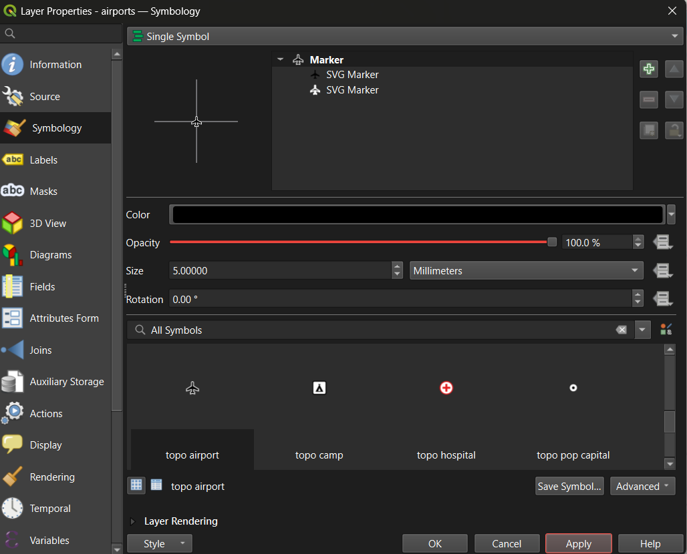
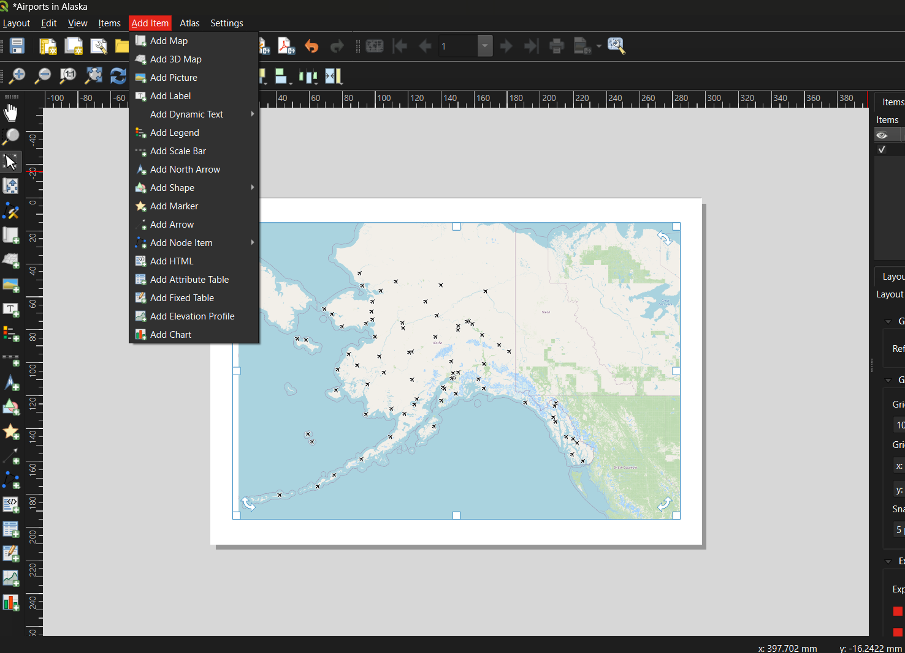
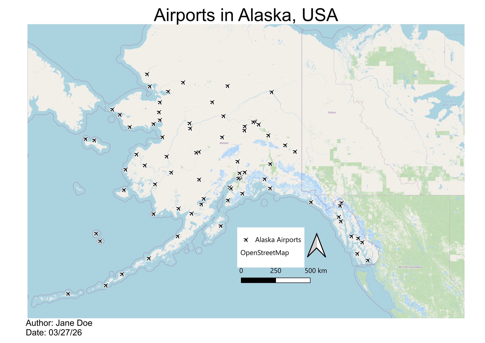

:::::::::::::::::::::::::::::::::::::: questions

- How do I load spatial data into QGIS?
- How can I add different types of vector data — shapefiles, CSV files, and live OSM data — to a map?
- How do I style and symbolize data to communicate clearly?
- How do I build and export a finished, publication-ready map layout?

::::::::::::::::::::::::::::::::::::::::::::::::

::::::::::::::::::::::::::::::::::::: objectives

- Load and explore spatial datasets from multiple sources
- Install and use QGIS plugins to extend functionality
- Style layers using Single Symbol, Categorized, and Graduated options
- Build a map layout with all essential map elements
- Export a publication-ready map as an image or PDF

::::::::::::::::::::::::::::::::::::::::::::::::

::::::::::::::::::::::::::::::::::::: keypoints

- QGIS can load vector data from shapefiles, GeoJSON files, geocoded CSV files, and live OpenStreetMap queries.
- Layer order matters — drag layers so that points and polygons of interest sit above basemap layers.
- Styling choices (symbol, color, size) should serve the map's purpose, not just look decorative.
- A complete map layout includes a title, legend, scale bar, north arrow, and data source credit.
- Save your project frequently using `.qgz` — losing work to an unsaved session is the most common beginner mistake.

::::::::::::::::::::::::::::::::::::::::::::::::

## Introduction

QGIS is a free, open-source Geographic Information System that runs on Windows, macOS, and Linux. In this episode we will go from a blank project to a finished, exported map using real spatial data.

We will work through three stages:

1. **Loading data** — adding a basemap, shapefiles, and point data
2. **Styling layers** — controlling how features look on the map
3. **Creating and exporting a layout** — building a finished map with all required elements

---

## Part 1: Loading Data

### Step 0: Create a Project Folder

Before opening QGIS, create a folder on your desktop called **Session_1a**. All data files you download will go here, and your QGIS project file (`.qgz`) will be saved here too. Keeping data and project files together prevents broken layer links later.

---

### Step 1: Add a Basemap

1. In the **Browser Panel**, click on **XYZ Tiles**.
2. You will see two options: **Global Terrain** and **OpenStreetMap**.
3. Right-click **OpenStreetMap** and select **Add Layer to Project**.
4. A world map should now appear in the **Map Panel**.

---

### Step 2: Download and Add a Shapefile

We will use the QGIS sample dataset for this walkthrough. Download the airport data from the [QGIS Sample Data repository](https://github.com/qgis/QGIS-Sample-Data/tree/master/qgis_sample_data) — specifically, `airports.shp` from the `shapefiles` folder.

A shapefile is not a single file. You must download all of the following supporting files alongside the `.shp` or the layer will not load correctly:

| File | Purpose |
|---|---|
| `airports.shp` | Geometry (the point locations) |
| `airports.dbf` | Attribute table (the data) |
| `airports.prj` | Coordinate reference system |
| `airports.shx` | Spatial index |
| `airports.cpg` | Character encoding |

Save all files to your **Session_1a** folder.

To add the shapefile to your map:

1. Go to **Layer → Add Layer → Add Vector Layer**.
2. Under **Source**, click the **…** button and navigate to `airports.shp`.
3. Click **Add**, then close the dialog.
4. In the **Layers Panel**, drag the `airports` layer above the OpenStreetMap layer so the airport points appear on top of the basemap.

::::::::::::::::::::::::::::::::::::: callout

### Layer Order Matters

QGIS draws layers from bottom to top. If your data layer is underneath the basemap in the Layers Panel, it will be hidden. Always check that your data sits above any basemap layers.

::::::::::::::::::::::::::::::::::::::::::::::::

---

### Step 3: Explore the Attribute Table

The attribute table contains the data values behind every feature on the map. To open it:

1. Right-click the `airports` layer in the Layers Panel.
2. Select **Open Attribute Table**.
3. You should see 76 rows — one for each airport in Alaska.

Explore the columns: you will see fields for airport name, elevation, and other attributes that can be used to style the map in the next section.

::::::::::::::::::::::::::::::::::::: callout

### Save Often

Go to **Project → Save** (or Ctrl+S / Cmd+S) regularly. QGIS does not autosave. Losing progress to an unsaved session is the single most common beginner mistake.

::::::::::::::::::::::::::::::::::::::::::::::::

---

## Part 2: Styling Your Map

### Step 1: Open Layer Properties

Right-click the `airports` layer → **Properties** → navigate to the **Symbology** tab.

---

### Step 2: Choose a Symbol Style

QGIS offers three main styling modes:

| Style | Use when... | Example |
|---|---|---|
| **Single Symbol** | All features should look the same | All airports shown as identical blue dots |
| **Categorized** | Features belong to named groups | Airports colored by type (international, regional, private) |
| **Graduated** | Features vary along a numeric scale | Airport symbols sized by elevation |

For the airports layer, try **Single Symbol** first to get comfortable with the controls. You can adjust the marker shape, size, color, and transparency from this panel.

**Tip:** Set the Magnifier at the bottom of the Map Panel to 75% if the map feels too large for your screen.

**Tip:** To rename a layer (which also controls how it appears in the legend), right-click the layer → **Properties → Source → Layer Name**. Give it a clear, human-readable name before building your layout.

---

### Step 3: Apply a Graduated Style (Optional — for numeric data)

Graduated symbology is useful when your data has a meaningful numeric field. The QGIS sample data includes an elevation CSV (`elevp`) in the `csv` folder of the same repository. Download it and try:

1. Load the CSV as a delimited text layer (see Part 3, Step 2 below for the full method).
2. Open its Symbology → select **Graduated**.
3. Choose the elevation field as the value column.
4. Select a sequential color ramp (light to dark).
5. Adjust the number of classes and click **Apply**.

This is the same graduated approach you would use for a choropleth map of Census data or any other continuous numeric variable.

---

## Part 3: Adding Different Data Types

Real-world GIS projects rarely use a single data source. This section covers the three most common ways to bring vector data into QGIS.

---

### Method 1: Add a Downloaded Shapefile

This is the method covered in Part 1 Step 2 above. Use it for any shapefile you have downloaded to disk:

1. **Layer → Add Layer → Add Vector Layer**
2. Browse to the `.shp` file
3. Click **Add**

Alternatively, locate the folder containing your shapefiles in your file explorer and **drag the `.shp` file directly onto the Layers Panel**.

---

### Method 2: Add a Geocoded CSV File (Point Data from Coordinates)

If you have a spreadsheet containing latitude and longitude columns, QGIS can treat it as a point layer. We will use a UFO sightings dataset for this example — download it from the shared Session 1a Google folder (`UFOreports_USonly_WorkshopLayer.csv`) and save it to your Session_1a folder.

1. Click the **Open Data Source Manager** button in the toolbar (or **Layer → Data Source Manager**).
2. Select **Delimited Text** in the left panel.
3. In the **File Name** field, navigate to `UFOreports_USonly_WorkshopLayer.csv`.
4. Confirm that **File Format** is set to **CSV**.
5. Verify that the **X field** and **Y field** are set to the longitude and latitude columns respectively.
6. Click **Add**, then close the dialog.

This creates a temporary point layer. If you want to keep it permanently, right-click the layer → **Export → Save Features As…** and save it as a shapefile or GeoPackage.

---

### Method 3: Add Live Data via the QuickOSM Plugin

OpenStreetMap contains a vast, continuously updated collection of mapped features — roads, buildings, parks, universities, restaurants, and much more. The QuickOSM plugin lets you query this data directly from within QGIS without downloading anything manually.

**Install the plugin first:**

1. Go to **Plugins → Manage and Install Plugins…**
2. Search for **QuickOSM** and click **Install Plugin**.
3. While you have the plugin manager open, also install **NextGIS QuickMapServices** — this gives you access to a much wider range of basemap options beyond OpenStreetMap.

**Run a query:**

1. Go to **Vector → QuickOSM → Quick Query**.
2. In the **Preset** field, type `university` and select **facilities/education/universities**.
3. In the **In** field, type `West Lafayette, IN`.
4. Click **Run Query**. A polygon layer for Purdue University's campus should appear on your map.
5. Right-click the new layer → **Properties → Symbology** to adjust its color and transparency.

Try a second query: repeat the process with `shops/food` in the Preset field and the same location. This returns footprints for food stores around Purdue's campus.

::::::::::::::::::::::::::::::::::::: callout

### OSM Feature Tags

OpenStreetMap uses a structured tagging system to classify features. To explore what categories are available (roads, healthcare facilities, landuse types, and more), see the [OSM Map Features Wiki](https://wiki.openstreetmap.org/wiki/Map_features).

::::::::::::::::::::::::::::::::::::::::::::::::

---

## Part 4: Creating a Map Layout

The **Print Layout** is QGIS's dedicated tool for building finished, export-ready maps. It is separate from the main map canvas — the main canvas is for exploration, the Print Layout is for publication.

### Step 1: Open a New Layout

1. Go to **Project → New Print Layout** (or click the New Print Layout icon in the toolbar).
2. Give the layout a name and click **OK**.
3. A new window will open with a blank white canvas representing your page.

---

### Step 2: Add the Map Frame

1. In the toolbar on the left side of the Layout window, click **Add Item → Add Map**.
2. Draw a rectangle on the canvas by clicking and dragging. The current map view from your main canvas will appear inside the rectangle.
3. Use the **Item Properties** panel on the right to lock the scale or adjust the extent if needed.

---

### Step 3: Add All Required Map Elements

A complete, publication-ready map must include the following elements. Use the **Add Item** menu in the toolbar to insert each one:

| Element | How to add | Notes |
|---|---|---|
| **Title** | Add Item → Add Label | Draw a text box at the top of the canvas; enter a descriptive title |
| **Legend** | Add Item → Add Legend | QGIS auto-populates from layer names — this is why renaming layers matters |
| **Scale Bar** | Add Item → Add Scale Bar | Choose units appropriate for your map extent |
| **North Arrow** | Add Item → Add North Arrow | Only strictly necessary if north is not obviously up |
| **Data credit / metadata** | Add Item → Add Label | Add at the bottom: your name, data sources, and date |

---

### Step 4: Export the Layout

Once you are satisfied with the layout:

1. Go to **Layout → Export as Image** (for PNG/JPEG) or **Layout → Export as PDF**.
2. Accept the default settings and click **OK**.
3. Return to the main QGIS window and save your project: **Project → Save** (`.qgz`).

Below is an example of a finished map created using this workflow — Alaska airports displayed as point symbols over an OpenStreetMap basemap:

---

## Common Beginner Mistakes

| Mistake | How to avoid it |
|---|---|
| Forgetting to save the project | Use Ctrl+S / Cmd+S frequently; save before every major step |
| Data layer hidden beneath the basemap | Check layer order in the Layers Panel; drag data layers above basemaps |
| Shapefile won't load | Ensure all five supporting files (`.dbf`, `.prj`, `.shx`, `.cpg`) are in the same folder as the `.shp` |
| Legend shows code names instead of readable labels | Rename layers before building the layout via **Properties → Source → Layer Name** |
| Map exports blank | Make sure the layout's map frame is linked to the correct map canvas |
| Overcomplicating symbology | Start with Single Symbol; add complexity only when it communicates something specific |

---

## Hands-On Exercise

::::::::::::::::::::::::::::::::::::: challenge

### Build a Multi-Layer Map of West Lafayette

In this exercise you will combine all three data-loading methods to build a multi-layer map.

**Setup:** Create a new QGIS project saved to your Session_1a folder.

#### **Step 1 — Download shapefiles from Natural Earth**

Go to [naturalearthdata.com](https://www.naturalearthdata.com) and read the homepage briefly to understand the data's purpose, scale, and reliability. Then navigate to **Downloads → Medium Scale Data** and download the following:

From **Cultural**:

- Admin-0 Country boundaries (polygon)
- Admin-1 States and Provinces (polygon)
- Populated Places (point)

From **Physical**:

- Rivers, Lake Centerlines (line)

Save all files to your Session_1a folder and add them to your QGIS project.

#### **Step 2 — Add UFO sighting data from a CSV**

Download `UFOreports_USonly_WorkshopLayer.csv` from the shared Session 1a Google folder. Use **Layer → Data Source Manager → Delimited Text** to add it as a point layer, setting the X and Y fields to the longitude and latitude columns.

#### **Step 3 — Add live OSM data**

Use the **QuickOSM** plugin to query two features in West Lafayette, IN:

- `facilities/education/universities` (to get Purdue University)
- `shops/food` (to get food stores near campus)

Style each layer with a distinct color and adjust transparency as needed.

#### **Step 4 — Build a map layout**

Turn off all layers except the Purdue campus polygon and the food stores layer. Open a new **Print Layout** and build a finished map that includes:

- A descriptive title
- A legend with readable layer names
- A scale bar
- A north arrow
- A data credit noting your name, data sources, and today's date

#### **Step 5 — Export**

Export your layout as both a PDF and a PNG image.

::::::::::::::::::::::::::::::::::::::::::::::::

---

::::::::::::::::::::::::::::::::::::: discussion

### Reflect on Your First Map

- What was the most confusing step in the workflow? How did you resolve it?
- Look at your finished map — what would you change to make it clearer for someone unfamiliar with the area?
- How does working with live OSM data (QuickOSM) differ from working with a downloaded shapefile? What are the trade-offs of each approach?

::::::::::::::::::::::::::::::::::::::::::::::::